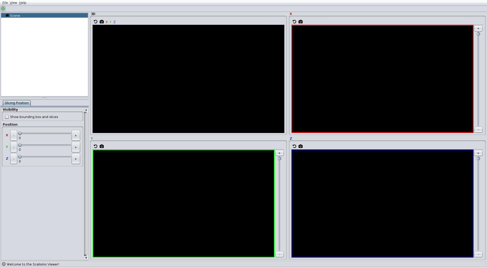
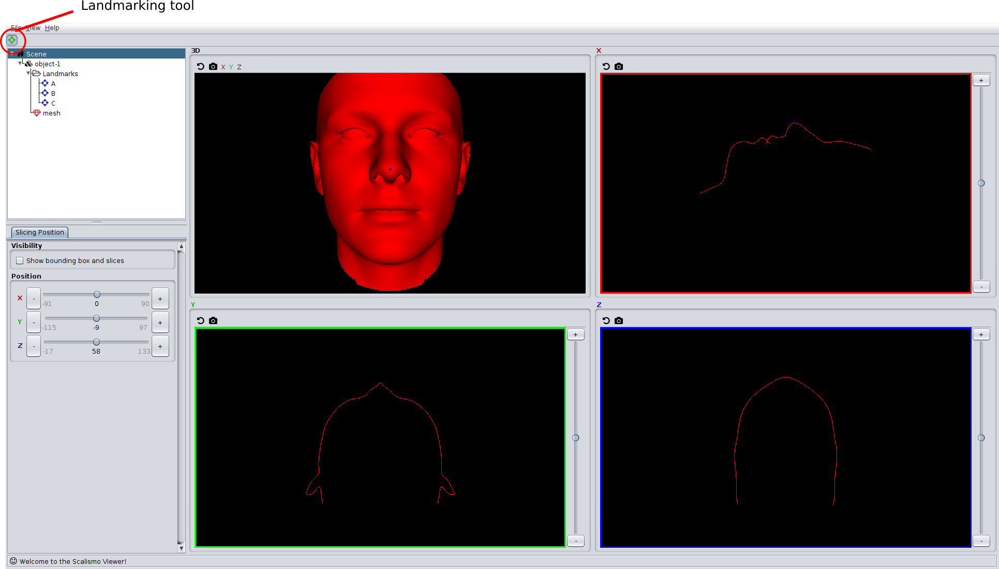

# Quickstart guide

In this quickstart guide we assume that you have already set up a project that has scalismo-ui as a dependency. We also assume that you have downloaded and the [example data](http://shapemodelling.cs.unibas.ch/data/ui-quickstart-data.zip)
and unzipped the data into your project folder.

To follow this quickstart guide, it is best to open a scala console and try
out the code interactively.

To get it out of the way, we import the following:
```scala
// api functions for scalismo-ui
import scalismo.ui.api._

// some objects and readers from scalismo
import scalismo.io._
import scalismo.geometry._
import scalismo.registration._

// some other things needed in the examples
import java.io.File
import java.awt.Color
import breeze.linalg.DenseVector
import breeze.stats.distributions.Gaussian

```


## Starting Scalismo-ui and creating groups

The first step is to create a ```ui``` object, with which we interact. This can be done by calling

```scala
val ui = ScalismoUI()
```

You will see that this starts the graphical user interface. Scalismo-ui features different perspectives on the data. In this guide we use the orthogonal view, which you can select from the menu ```View->Perspective->Orthognonal Slices```. You should now see the following window:



Before we can start visualizing objects, we need to create a group. A group is a collection of objects that belong together. A typical scenario is that we have an 3D image of a structure, but also a segmentation given in form of a surface mesh and maybe even some manually annotated landmark points. A group is created by calling

```scala
 val group = ui.createGroup("object-1")
```

## Visualizing objects

We start by loading a mesh using Scalismo:

```scala
val mesh = MeshIO.readMesh(new File("./data/facemesh.stl")).get
```

To visualize any scalismo object, we use the show method. As a first argument
we specify the group to which the objects belongs and the last argument is an identifier:

```scala
val meshView = ui.show(group, mesh, "mesh")
```

This call shows the mesh and returns a ```view``` object, which we can use to
interact with the visualization. For example we can change the color or the opacity

```scala
meshView.color = Color.RED
meshView.opacity = 1.0
```

We can also change the visibility of an object, and for example show it only in the
3D viewport, but not the slice views. This is done by calling

```scala
ui.setVisibility(meshView, Viewport._3dOnly)
```

To show it again in all viewports we call

```scala
ui.setVisibility(meshView, Viewport.all)
```

## Finding object views

We have seen that to interact with an object we need a view of that object. When we use the ```show``` method to visualize the object, we directly obtain the corresponding view. However, sometimes an object is created by the user, using the graphical user interface. A typical use case is that the user clicks landmarks on an object. In Scalismo-ui, landmarks can be defined by selecting the landmarking button in the top-left corner of the toolbar and  left-clicking on the object.


To work with the clicked landmarks, we need to obtain the corresponding views. This can be done using the filter method of the ui. This method is very similarly to a filter method of the Scala collections. It goes through all the objects in a group and returns a list of the object with the correct type that satisfy a given predicate. The view for the clicked landmarks can be obtained as follows:

```scala
val landmarkViews = ui.filter[LandmarkView](group, (v : LandmarkView) => true)
```

Exactly in the same way as we manipulated the display properties of the mesh, we can now change the properties of the landmarks using these views. We can also access the underlying
scalismo object and, for example, print out their point coordinates.

```scala
  for (landmarkView <- landmarkViews) {
    landmarkView.color = Color.RED
    println(landmarkView.landmark.point)
  }
```

## Adding transformations

Scalismo-ui does not only allow us to visualize static objects, but can also be used
to visualize transformations and deformations of the objects in a group. This can be achieved
by adding a transformation to the group; i.e. a function that maps every 3D point in the scene to another 3D point. The following example flips the objects in the group along the y axis.

```scala
val transformationView = ui.addTransformation(group, Transformation((p : Point[_3D]) => Point3D(p.x, -p.y, p.z)), "flip")
```

Note that this does not only turn the mesh upside down, but also the landmarks. This is a general rule: a transformation is always applied to all objects in the group.
To get back the original mesh, we simply remove the transformation by calling:

```scala
transformationView.remove()
```

Once we are done with the visualization, we can remove the entire group using
```scala
group.remove()
```

## Visualizing Statistical Shape Models

One of the important use cases that guided the development of scalismo-ui is the
visualization of statistical shape models. A statistical shape model is
just a mesh that is transformed by a parametric family of transformation.
Let's load a statistical shape model and visualize it:

```scala
val ssm = StatismoIO.readStatismoMeshModel(new File("data/facemodel.h5")).get
val ssmGroup = ui.createGroup("shape-model")
val ssmView = ui.show(ssmGroup, ssm, "ssm")
```

In scalismo-ui, a statistical shape model is represented as a mesh together with two
transformations:  one (rigid) transformation that controls the pose of the mesh and
one that controls the actual shape. We can access the individual parts of an ssm using
the ```ssmView``` object.

```scala
 ssmView.meshView
 ssmView.shapeModelTransformationView.shapeTransformationView
 ssmView.shapeModelTransformationView.poseTransformationView

```

The pose transformation and shape transformation are parametric transformations, and to change
the transformation, we can change their parameters. To visualize, for example,  a random shape of the statistical shape model, we can  create a random coefficient vector and set the shape transformation parameters accordingly.

```scala
    val randCoeffs = DenseVector.rand[Double](ssm.rank, Gaussian(0, 1))
    ssmView.shapeModelTransformationView.shapeTransformationView.coefficients = randCoeffs
  ```
This will immediately update the shape transformation to the transformation that
 is defined by these coefficients and the visualized mesh is deformed accordingly.  


## Visualizing other scalismo objects

The concepts that we described above are generic and in exactly the same way
any other scalismo object can be visualized: We use ```ui.show``` to visualize an object and interact with it using the corresponding view object,
which we obtain either directly from the show function, or by using the ```ui.filter``` or
```ui.find``` method.

Here is, howe we would visualize a 3D image:

```scala
  val group2 = ui.createGroup("object-2")
  val image = ImageIO.read3DScalarImage[Short](new File("./data/mri.nii")).get
  val imageView = ui.show(group2, image, "mri-image")
```

 The following list shows all the scalismo objects, which can currently be visualized
 in scalismo-ui.

 * 3D image ( [```DiscreteScalarImage[_3D,_]```](http://unibas-gravis.github.io/scalismo/latest/api/index.html#scalismo.image.DiscreteScalarImage) )
 * 3D vector field ([```DiscreteField[_3D, Vector[_3D]]```](http://unibas-gravis.github.io/scalismo/latest/api/index.html#scalismo.common.DiscreteField))
 * Point cloud (```IndexedSeq[Point[_3D]]```)
 * Landmark ([```Landmark[_3D]```](http://unibas-gravis.github.io/scalismo/latest/api/index.html#scalismo.geometry.Landmark))
 * Scalar field ([```DiscreteScalarField[_3D, _]```](http://unibas-gravis.github.io/scalismo/latest/api/index.html#scalismo.common.DiscreteScalarField))
 * Triangle mesh ([TriangleMesh[_3D]](http://unibas-gravis.github.io/scalismo/latest/api/index.html#scalismo.mesh.TriangleMesh))
 * Scalar mesh field( [```ScalarMeshField[_]```](http://unibas-gravis.github.io/scalismo/latest/api/index.html#scalismo.mesh.ScalarMeshField))
 * Line mesh ([```LineMesh[_3D]```](http://unibas-gravis.github.io/scalismo/latest/api/index.html#scalismo.mesh.LineMesh))
